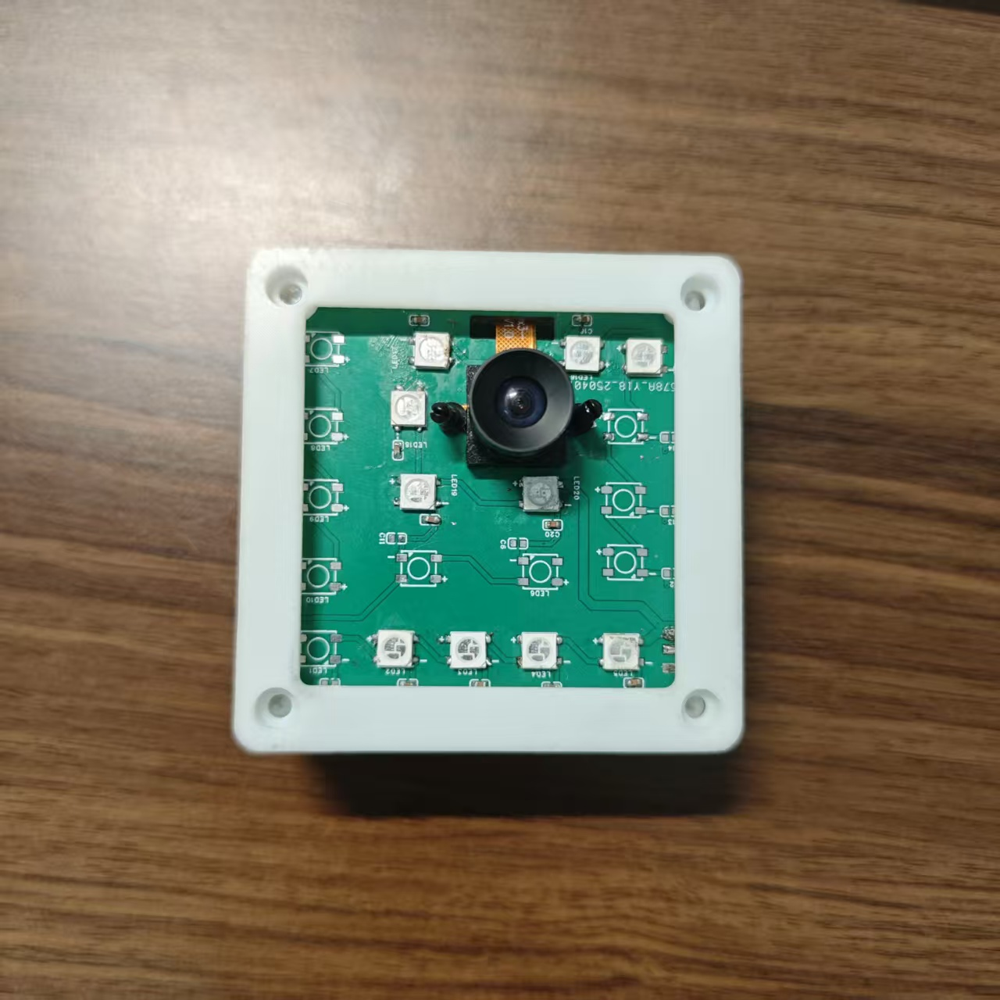
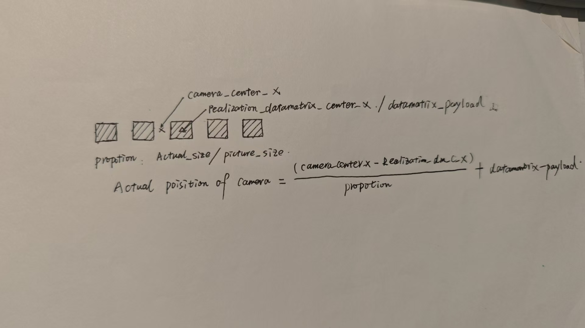

# VisualPosition

## 一、程序使用说明

- 该程序使用的硬件是**cannan K230**，开发固件为**DongshanPi Micropython**
- 程序可用于静态检测数据矩阵码，并通过码值计算返回位置信息，最后通过串口发送位置信息到从机
- 读头离二维码的高度设定为12cm±4cm，若布置高度和设定高度差异大，可将`codestatus = 0`改为1,或者其他数字，即可像素比例系数
- 本程序可作为**cannan k230**的练手项目，或是二维码定位的一个简单参考
-   

## 二、识别原理简介

-
